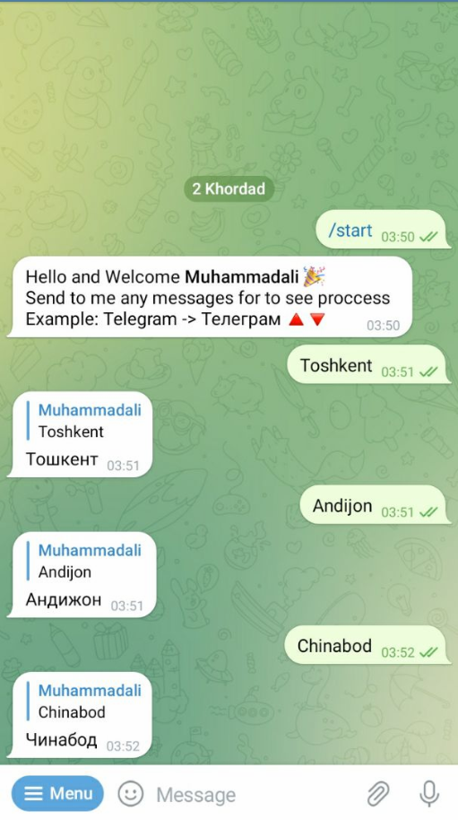

# Transliterater
## Telegram bot for transliterate built with Telebot

<p align="center">
 
</p>

### First get the repo on your machine:
```bash
$ git clone https://github.com/azimjohn/survey-bot.git
```


### Then install requirements:
```bash
$ pip install -r requirements.txt
```

### Make the migrations and apply them:
```bash
$ python manage.py makemigrations
$ python manage.py migrate
```

### Export the bot token, replace `REPLACE_ME` with your bot's token
```bash
$ export BOT_TOKEN=REPLACE_ME
```

### Finally, run the server 🎉
```bash
$ python manage.py runbot
```

